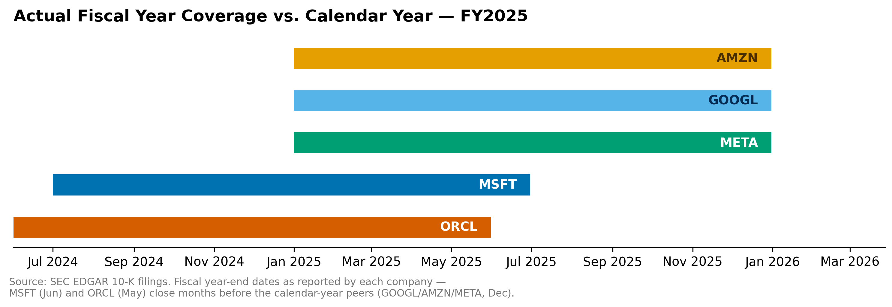

# Methodology

## Scope

- Five companies: MSFT, GOOGL, AMZN, ORCL, META; fiscal years 2019 onward (2019–2023 pre-AI baseline; 2024+ AI-era).
- All financial figures from SEC EDGAR's XBRL Company Facts API — 10-K, annual values only. No analyst estimates.

## Data Extraction Rules

- Annual value = form 10-K, fiscal period FY, and duration ≥ 350 days. Quarterly figures appear inside 10-Ks too and would otherwise contaminate the data — discovered when Microsoft's 2019 revenue first read $30.6B instead of the correct annual figure.
- Restatements: where a year appears in multiple filings, the most recently filed value is kept (Meta's 2020–2023 capex differs slightly from the original filings as a result).
- Tag names vary by company; canonical tags were chosen after coverage checks, with a priority-ordered fallback list used where a company switched tags mid-history (Alphabet's 2022 revenue exists only under the ASC 606 tag, not its usual `Revenues` tag).
- Amazon reports capex under `PaymentsToAcquireProductiveAssets`, a broader element than the PP&E-specific tag used by the other four — same cash-flow line, definitionally slightly wider.
- The Company Facts `fy` field is the *filing's* fiscal year, not the value's; fiscal year is derived from the period-end date instead.
- The `frame` field is calendar-based and not present on all entries; used informationally, never as a filter.

## Pipeline Design

- SQLite table `fin_data`: columns `cik, ticker, tag, fiscal_year, filed_fy, fiscal_period, form_type, filing_date, end_of_period, frame, unit, value, metric`.
- Primary key is composite: `(cik, metric, fiscal_year)`. Simpler keys were tried and failed — a tag-only key collided when a company reported the same metric under two different tags in one year; a filing-date-based key collided because a single filing contains many facts.
- Idempotency: `INSERT OR IGNORE`. Verified by running the full pipeline twice and confirming identical row counts both times.
- Restatements: entries are sorted by filing date, newest first, before insert — so under `INSERT OR IGNORE`, the most recently filed (most current) value is the one that sticks.
- Politeness: SEC requires a descriptive `User-Agent` header (name + email) and enforces a 10 requests/second limit; the fetcher sleeps 0.2s between calls.

## Verification

- Reconciled directly to 10-K cash flow statements: Meta FY2024 ($37,256M), Amazon FY2024 ($82,999M), Oracle FY2024 ($6,866M — line labeled "Capital expenditures").
- A post-load coverage check runs after every load (row counts per company/metric, min/max year) to catch missing or duplicated data before it reaches the analysis.

## Fiscal-Year Alignment

- Fiscal years are not calendar-aligned across the five companies: GOOGL/AMZN/META end in December, MSFT ends in June, ORCL ends in May — up to a 7-month spread on a nominally "same" fiscal year.
- Each company's own fiscal-year label is used rather than rebuilding on trailing-twelve-month quarterly data, since the magnitude of the finding (18–83% capex/revenue) is far larger than the timing gap could produce.
- Directional check: since capex is accelerating, an earlier-closing fiscal year (Oracle, Microsoft) captures less of the most recent ramp than a later-closing one — meaning the misalignment likely *understates* Oracle's divergence rather than inflating it.
- MSFT and ORCL have FY2026 10-Ks filed as of this analysis; the December-year companies do not yet, so their latest data point runs one fiscal year ahead.
- See `fy_windows.jpg` for the calendar-window breakdown behind this decision.

## AI Disclosures (Manual Layer)

- Scope: same five companies, but the most-recent-available quarter as of the research date (July–Aug 2026) — not the FY2025 comparability cutoff used for the structured chart data, since this layer isn't trying to align years across companies, just capture the most current color available.
- Four disclosure types tracked per company: `ai_revenue`, `capex_guidance`, `depreciation_policy`, `ai_capital_raise` (the last one added mid-project once a financing pattern emerged across companies).
- Source hierarchy: primary sources only — earnings call transcripts, 10-Q/10-K filings, official investor-relations press releases. Third-party transcript sites were used only to identify the correct quarter and date, never cited as the source of record.
- Status field: `Disclosed` / `Partial` / `Not Disclosed`. `Partial` means a real but non-isolated figure — a floor rather than an exact number ("more than $25B"), or a segment-wide proxy (Azure/Cloud/AWS revenue standing in for AI revenue specifically) rather than an AI-only figure.
- Verification: cross-checked against independent sources where possible. One caught-and-corrected error worth logging: an Amazon capex figure was initially flagged as non-reconciling, then confirmed correct after comparing the right year-over-year quarters (trailing-twelve-months vs. trailing-twelve-months, not sequential quarters) — kept in as an example of the check working as intended.
- Key cross-company findings: every company's strongest AI-revenue figure is a proxy except Meta's Advantage+ ($75B+ run-rate), a genuinely isolated AI-product figure. Depreciation useful-life stories diverge sharply — Microsoft and Oracle made simple extensions, Amazon moved in both directions for different asset subsets, Meta uniquely quantified its dollar impact ($2.92B), and Alphabet's 10-Q discloses no useful-life table at all. On financing: all five companies disclosed unusual capital activity tied to the buildout, and no two took the same approach — Oracle (debt raise), Amazon (equity stakes outward into OpenAI/Anthropic), Alphabet (simultaneous debt + equity raise), Meta (debt + BlackRock joint venture), Microsoft (self-funded from operating cash flow, no major raise).

## Visualization

- Headline chart: capex-as-percent-of-revenue by company, FY2019–2026, one line per ticker.
- Solid line through FY2025 for all five companies (the last year every company has filed — ensures comparability); dashed extension to FY2026 for MSFT and ORCL only, since they've filed that year and the calendar-year three haven't yet.
- Oracle is kept on a true linear scale despite dominating the chart (83% by FY2026) — the divergence is the finding, not an artifact to smooth over.
- Colorblind-safe palette (Okabe-Ito); direct end-of-line labels used instead of a legend; source and fiscal-year-alignment caveat embedded directly in the image.

## Tools

| File | Purpose |
|---|---|
| `fetch_sec_data.py` | Idempotent SEC → SQLite pipeline. Primary key `(cik, metric, fiscal_year)`. |
| `explore_tags.py` | Tag discovery by keyword, across XBRL namespaces. |
| `queries/capex_pct.sql` | Pivots raw data into capex, revenue, and capex/revenue by company-year. |
| `plot_capex_pct.py` | Generates the headline chart from live data. |
| `plot_fy_windows.py` | Generates the fiscal-year alignment chart from live data. |
| `ai_disclosures.csv` | Manually curated AI-revenue, capex-guidance, depreciation-policy, and financing findings. |
